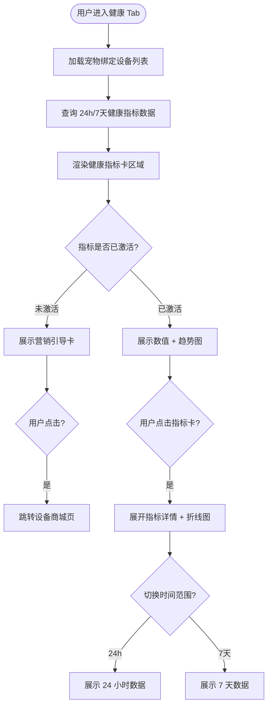
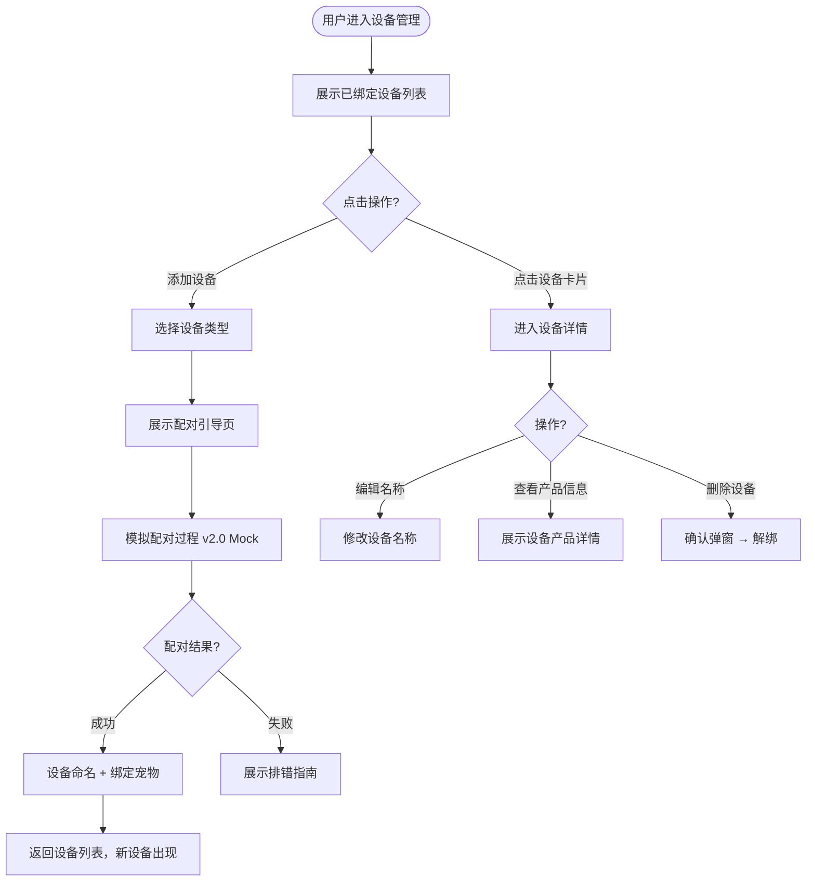
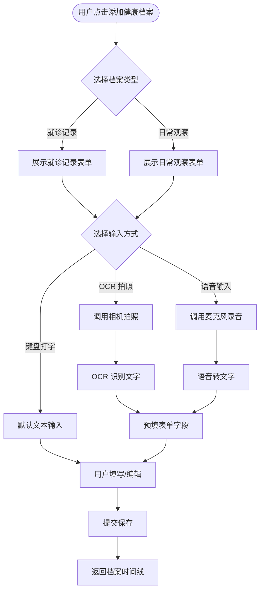
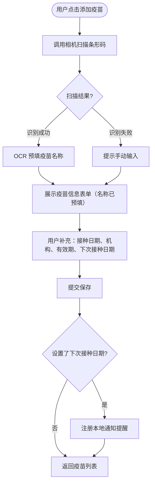
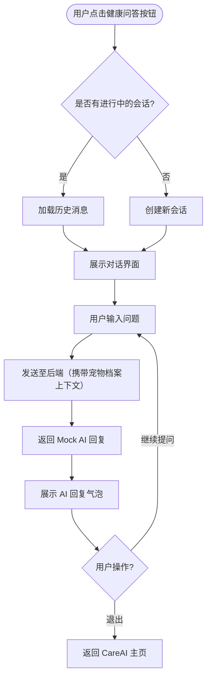
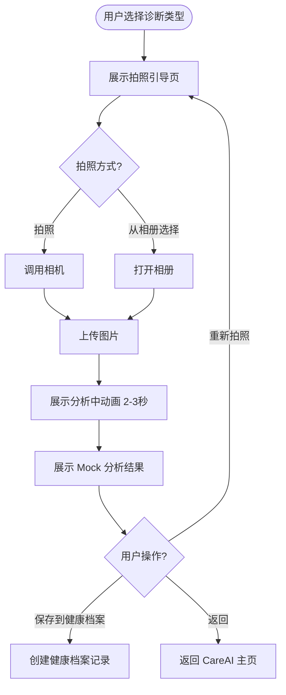
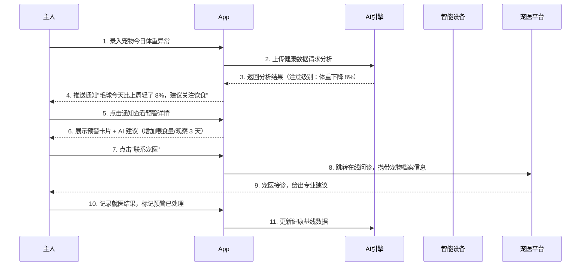

# PawMind — AI 宠物健康管理平台

## 产品定位

PawMind 是面向**城市养宠人群**的 AI 宠物健康管理 App，通过智能设备数据采集、健康指标可视化、AI 辅助诊断和健康知识服务，帮助主人全面掌握宠物健康状况，及时发现健康隐患。

**核心理念**：让 AI 成为宠物的私人健康管家。

### 核心数据流

```
多渠道健康数据（设备自动上报 / 手动录入 / 拍照扫描）
  → 数据聚合与指标计算
  → 健康指标可视化（24h / 7天）
  → AI 健康分析（异常检测 / 诊断 / 问答）
  → 主人知情 & 行动（预警 / 报告 / 就医建议）
```

---

## 一、产品架构总览

### 1.1 全局结构图（移动端 App）

```
┌─ 顶部导航栏 ─────────────────────────────────────────────┐
│  PawMind Logo      [宠物昵称/切换]      通知铃 🔔  头像   │
├────────────────────────────────────────────────────────┤
│                                                        │
│                    主内容区                             │
│  ┌─────────────────────────────────────────────────┐  │
│  │                                                 │  │
│  │   今日状态卡 / CareAI / 健康指标 / 功能页面       │  │
│  │                                                 │  │
│  └─────────────────────────────────────────────────┘  │
│                                                        │
├────────────────────────────────────────────────────────┤
│ 底部 TabBar                                            │
│  🏠 首页    🩺 CareAI    📊 健康    📸 成长册    👤 我   │
└────────────────────────────────────────────────────────┘
```

### 1.2 信息层级

```
用户账号（全局唯一，支持多宠物管理）
  └ 宠物档案（每只宠物独立档案）
      ├ 基础信息（品种 / 年龄 / 体重）
      ├ 绑定设备列表
      │   └ 设备详情（类型 / 电量 / 网络 / 产品信息）
      ├ 健康数据
      │   ├ 实时指标（设备上报：饮水量/饮食量/运动量/睡眠/体温/心率/排便）
      │   ├ 手动录入（体重/饮食量/饮水量/体温/排便）
      │   └ 指标可视化（24h / 7天趋势）
      ├ 健康档案
      │   ├ 就诊记录（诊断/处方/医嘱）
      │   └ 日常观察（自由文本/标签）
      ├ 电子疫苗本
      │   └ 疫苗记录（条形码扫描 + 接种提醒）
      ├ CareAI 记录
      │   ├ 健康问答历史
      │   ├ AI 诊断报告（口腔/粪便/皮肤/报告/药品）
      │   └ 每日小知识
      ├ 成长日记（照片 / 视频 / 里程碑）
      └ 行为分析（v3.0+）
```

### 1.3 核心数据模型

```
用户（User）
  ├ id, email, passwordHash, nickname, avatar
  └ createdAt, updatedAt

宠物档案（Pet）
  ├ id, userId, name, species, breed, birthday, gender, weight
  ├ avatar, personalityTags, status
  └ createdAt, updatedAt

设备商品（DeviceProduct）
  ├ id, name, type, brand
  ├ description, specs (JSON), imageUrl
  └ purchaseUrl, price, createdAt

绑定设备（Device）
  ├ id, userId, petId, productId
  ├ name, deviceType, serialNumber
  ├ status (online/offline), batteryLevel, networkStatus
  └ bindTime, createdAt, updatedAt

健康指标（HealthMetric）
  ├ id, petId, metricType, value, unit
  ├ source (device/manual), deviceId
  └ recordedAt, createdAt

健康日志（HealthLog）
  ├ id, petId, date
  ├ weight, appetiteLevel, activityLevel, waterIntake
  ├ symptoms, notes
  ├ isAlert, alertType, severity
  └ createdAt, updatedAt

健康档案（HealthRecord）
  ├ id, petId, recordType (visit/observation)
  ├ visitDate, hospitalName, diagnosis, prescription, doctorAdvice
  ├ content, tags (JSON), inputMethod, attachments (JSON)
  └ createdAt, updatedAt

疫苗记录（Vaccination）
  ├ id, petId, vaccineName, barcode
  ├ vaccinationDate, expiryDate, nextDueDate
  ├ institution, batchNumber, notes
  └ createdAt, updatedAt

CareAI 会话（CareAiSession）
  ├ id, petId
  └ createdAt, updatedAt

CareAI 消息（CareAiMessage）
  ├ id, sessionId, role (user/assistant), content
  └ createdAt

每日小知识（DailyTip）
  ├ id, title, content, summary
  ├ category, targetSpecies, source (fixed/ai_generated)
  └ isActive, publishDate, createdAt

AI 诊断报告（DiagnosisReport）
  ├ id, petId, sessionId
  ├ diagnosisType, imageUrl
  ├ resultSummary, resultDetail (JSON)
  └ savedToRecord, createdAt

成长记录（GrowthRecord）
  ├ id, petId, type, content, mediaUrl
  └ createdAt

关联关系：
  - 用户 1 对多 宠物档案
  - 用户 1 对多 绑定设备
  - 宠物 1 对多 绑定设备
  - 宠物 1 对多 健康指标
  - 宠物 1 对多 健康档案
  - 宠物 1 对多 疫苗记录
  - 宠物 1 对多 CareAI 会话
  - 宠物 1 对多 诊断报告
  - 宠物 1 对多 成长记录
  - 设备 1 对多 健康指标（source=device）
  - 设备商品 1 对多 绑定设备
  - CareAI 会话 1 对多 CareAI 消息
  - 删除宠物档案时级联归档（不物理删除）
```

---

## 二、用户与使用场景

### 2.1 典型用户画像

| 用户类型 | 特征描述 | 核心需求 |
|----------|----------|----------|
| **忙碌打工人** | 25-35 岁城市白领，独居养宠，工作日办公室超 10 小时 | 快速了解宠物状态，低门槛陪伴 |
| **健康焦虑型主人** | 对宠物健康高度重视，愿意记录详细数据 | 全面健康追踪，异常预警，就医辅助 |
| **新手宠主** | 刚养宠，不了解宠物行为规律 | 饲养建议，健康知识，AI 辅助诊断 |
| **多设备用户** | 已购买智能喂食器、项圈等硬件 | 设备统一管理，数据自动同步 |

### 2.2 核心用户旅程图（User Journey Map）

| 阶段 | 触点 | 用户行为 | 痛点/情绪 | 机会点/功能 |
|------|------|----------|-----------|-------------|
| **1. 发现** | 社交媒体/口碑 | 看到"AI 宠物健康"内容 | 半信半疑 | 用健康报告截图传播，营造社交货币 |
| **2. 注册建档** | App 首启动 | 填写宠物信息、上传照片 | 流程繁琐 | 3 步建档，AI 生成性格速写 |
| **3. 设备绑定** | 设备管理页 | 购买设备后绑定到 App | 不知兼容性，绑定复杂 | 展示型商城 + 配对引导 |
| **4. 日常监测** | 健康 Tab | 每天查看健康指标 | 数据分散，无法一眼看出状态 | 健康指标卡（24h/7天汇总） |
| **5. 异常处理** | 推送通知 | 收到异常提醒，查看详情 | 不知严重程度，慌乱 | AI 分级预警 + 就医建议 |
| **6. 健康咨询** | CareAI | 发现异常时咨询 AI | 网上信息杂乱不可靠 | CareAI 健康知识问答 |
| **7. 成长记录** | 成长册 | 记录精彩瞬间，分享 | 照片散乱，无成就感 | AI 月度报告，一键分享 |

---

## 三、核心功能清单

### 3.1 健康管理模块（升级）

| 功能点 | 描述 | 优先级 |
|--------|------|--------|
| 健康指标卡 | 展示 24h/7天核心健康指标汇总，设备驱动显示 | P0 |
| 指标数据可视化 | 各指标的趋势折线图，支持时间范围切换 | P0 |
| 设备驱动显示 | 已绑定设备的指标正常展示，未绑定的显示营销引导卡 | P0 |
| 手动录入指标 | 体重、饮食量、饮水量、体温、排便情况手动录入 | P0 |
| 设备数据接收 | 接收智能设备上报的健康数据（v2.0 Mock） | P1 |
| 异常预警 | 基于指标阈值检测异常并推送 | P0 |

#### 指标与设备映射

| 指标 | 数据来源设备 | 手动可录 |
|------|------------|---------|
| 饮食量 | 智能喂食器 | ✅ |
| 饮水量 | 智能饮水机 | ✅ |
| 运动量/步数 | 智能项圈 | ❌ |
| 睡眠时长 | 智能项圈 | ❌ |
| 体温 | 智能项圈 | ✅ |
| 心率 | 智能项圈 | ❌ |
| 排便情况 | 智能猫砂盆 | ✅ |
| 体重 | 无（纯手动） | ✅ |

### 3.2 设备管理模块（新增）

| 功能点 | 描述 | 优先级 |
|--------|------|--------|
| 设备列表 | 展示已绑定设备卡片（名称、图标、电量、连接状态） | P0 |
| 添加/绑定设备 | 选择设备类型 → 配对引导 → 绑定确认 | P0 |
| 设备详情 | 设备名称（可编辑）、绑定时间、电量、网络状态、产品信息 | P0 |
| 删除设备 | 解绑设备，确认弹窗 | P0 |
| 设备商城 | 展示型商城，设备列表 + 参数介绍 + 外部购买链接 | P1 |
| 绑定指南 | 图文引导用户完成设备配对 | P1 |

### 3.3 健康档案模块（新增）

| 功能点 | 描述 | 优先级 |
|--------|------|--------|
| 添加就诊记录 | 就诊日期、医院名称、诊断结果、处方用药、医嘱、附件图片 | P0 |
| 添加日常观察 | 记录日期、观察内容（自由文本）、标签 | P0 |
| 多输入方式 | 底部工具栏切换：键盘打字 / OCR 拍照识别 / 语音输入 | P0 |
| 档案时间线 | 按时间倒序展示所有健康档案 | P0 |
| 档案编辑/删除 | 编辑已有记录、删除（确认弹窗） | P1 |

### 3.4 电子疫苗本模块（新增）

| 功能点 | 描述 | 优先级 |
|--------|------|--------|
| 疫苗列表 | 按时间倒序展示已接种疫苗，待接种疫苗置顶提醒 | P0 |
| 添加疫苗记录 | 扫描条形码 → OCR 预填疫苗名称 → 手动补充信息 | P0 |
| 条形码扫描 | 调用相机扫描疫苗条形码，OCR 识别疫苗名称预填表单 | P0 |
| 接种提醒 | 基于下次接种日期推送本地通知 | P1 |
| 编辑/删除疫苗 | 编辑已有记录、删除（确认弹窗） | P1 |

### 3.5 CareAI 模块（替换原 AI 陪伴）

| 功能点 | 描述 | 优先级 |
|--------|------|--------|
| CareAI 主页 | 顶部每日小知识 + 中部 AI 诊断入口宫格 + 底部悬浮问答按钮 | P0 |
| 健康知识问答 | 对话式交互，用户提问宠物健康问题，AI 回复 | P0 |
| 每日小知识 | 固定知识库每日推送一条，按分类组织，可回看历史 | P0 |
| AI 诊断 — 口腔检查 | 拍照引导 → 上传 → Mock 分析结果 | P1 |
| AI 诊断 — 粪便检查 | 拍照引导 → 上传 → Mock 分析结果 | P1 |
| AI 诊断 — 皮肤检查 | 拍照引导 → 上传 → Mock 分析结果 | P1 |
| AI 诊断 — 报告解读 | 拍照引导 → 上传 → Mock 分析结果 | P1 |
| AI 诊断 — 药品识别 | 拍照引导 → 上传 → Mock 分析结果 | P1 |
| 诊断结果保存 | 分析结果可保存到健康档案 | P1 |
| 免责声明 | 所有诊断结果页展示「AI 分析仅供参考，不替代专业诊断」 | P0 |

### 3.6 成长记录模块（保留）

| 功能点 | 描述 | 优先级 |
|--------|------|--------|
| 照片/视频上传 | 随时记录宠物照片视频，附文字 | P0 |
| 时间轴展示 | 按时间倒序展示所有成长内容 | P0 |
| 里程碑标记 | 标注首次疫苗/生日/特殊事件等节点 | P1 |
| AI 月度报告 | 每月自动生成图文成长总结 | P1 |
| 一键分享图 | 生成精美分享图（带水印），发朋友圈 | P1 |
| 成长册导出 | 导出 PDF 版成长纪念册 | P2 |

---

## 四、详细方案设计

### 4.1 健康管理 — 数据可视化

#### 交互流程图



#### 功能规则

- 健康指标卡区域位于健康 Tab 顶部，横向滑动展示所有指标
- 已激活指标显示：指标名称、当前值、单位、对比上一周期的变化（↑/↓/持平）
- 点击指标卡展开详情，展示时间范围内的折线趋势图
- 手动可录指标在详情页提供「手动录入」入口
- 未绑定对应设备的指标卡显示为灰色锁定状态，文案「快来解锁{指标}监测，关注毛孩子的健康吧」

---

### 4.2 设备管理 — 绑定流程

#### 交互流程图



---

### 4.3 健康档案 — 多输入方式

#### 交互流程图



---

### 4.4 电子疫苗本 — 条形码扫描

#### 交互流程图



---

### 4.5 CareAI — 健康知识问答

#### 交互流程图



#### 功能规则

- 对话界面类似聊天 UI，用户消息靠右，AI 回复靠左
- v2.0 Mock：预置常见宠物健康问题的回答模板，关键词匹配
- 匹配不到时返回「这个问题我还在学习中，建议咨询专业宠医哦」
- AI 服务层抽象为接口，后续替换真实 AI API 无需修改前端
- 自动携带当前宠物的品种、年龄、体重作为上下文

---

### 4.6 CareAI — AI 诊断

#### 统一交互流程



#### 各诊断类型差异

| 诊断类型 | 拍照引导 | Mock 结果示例 |
|---------|---------|-------------|
| 口腔检查 | 示例图引导拍摄口腔内部 | 口腔健康评分 85/100，牙齿状况良好，建议定期洁牙 |
| 粪便检查 | 引导拍摄粪便全貌 | 形态正常（布里斯托 4 型），颜色正常，未见异常 |
| 皮肤检查 | 引导拍摄皮肤患处 | 皮肤状况评估：轻微发红，建议观察 3 天，如持续请就医 |
| 报告解读 | 引导拍摄检验报告 | 检测到 5 项指标，其中 2 项偏高（标注），建议咨询宠医 |
| 药品识别 | 引导拍摄药品包装/说明书 | 药品名称、主要成分、宠物用药注意事项 |

#### 免责声明

所有诊断结果页底部固定展示：「⚠️ AI 分析仅供参考，不替代专业兽医诊断。如有疑虑，请及时就医。」

---

## 五、业务流程图

### 主链路：健康异常检测 → 主人处理



---

## 六、异常与边界处理

| 异常场景 | 系统处理 / 提示文案 |
|----------|---------------------|
| **网络断开（AI 对话中）** | Toast："网络开小差了，消息已暂存，恢复后自动发送" |
| **宠物档案为空（首次使用）** | 全屏引导页：宠物插画 + "先来认识一下你的宠物吧～" + [开始建档] 按钮 |
| **健康数据为空** | 展示插画 + "还没有记录，今天就开始吧" + [记录今日健康] 按钮 |
| **成长册无内容** | 展示插画 + "快去记录第一个精彩瞬间" + [上传第一张照片] 按钮 |
| **AI 响应超时（>5s）** | 提示："宠物有点忙，稍后再试" + 重试按钮 |
| **设备离线** | 设备图标变灰 + 说明"设备暂时离线，请检查电源/网络" |
| **设备配对失败** | 展示排错指南：检查设备电源 / 蓝牙开启 / 距离等 |
| **条形码识别失败** | 提示"未能识别条形码，请手动输入疫苗名称" |
| **OCR 识别不准确** | 预填结果可编辑，提示"识别结果仅供参考，请确认后提交" |
| **相册权限未授权** | 弹窗引导："需要相册权限才能记录成长瞬间" + [去授权] 按钮 |
| **通知权限未授权** | 进入首页时 Banner 提示："开启通知，第一时间收到宠物状态提醒" |
| **图片上传失败** | Toast + 本地缓存，下次联网自动重传 |
| **月度报告 AI 生成失败** | 降级展示数据卡片，不显示 AI 文案段落 |
| **删除宠物档案** | 强弹窗确认："删除后所有记录将无法恢复，确认删除？" |
| **疫苗提醒时间已过** | 疫苗列表标记"已过期未接种"，红色高亮提醒 |

**边界场景自查清单：**
- [x] 首次使用（空状态引导 — 全部页面覆盖）
- [x] 网络异常（断网/弱网）
- [x] 权限不足（相册/通知/相机/麦克风）
- [x] 数据量为零（Empty State — 每个核心页面均设计）
- [x] 操作不可逆（删除前确认）
- [x] AI 服务降级（AI 失败时保留基础功能正常使用）
- [x] 设备离线/配对失败

---

## 七、AI 能力定位

```
触点 1：健康知识问答（对话级）
  - 能做：回答宠物健康相关问题，提供护理建议
  - 上下文：宠物档案（品种/年龄/体重）
  - v2.0 实现：Mock 回复，预置知识库关键词匹配
  - 预留：AI API 接口，后续接入大语言模型

触点 2：AI 拍照诊断（功能级）
  - 能做：分析宠物口腔/粪便/皮肤照片，解读检验报告，识别药品
  - v2.0 实现：Mock 分析结果，UI 和流程完整
  - 预留：多模态 AI API 接口，后续接入图像分析模型

触点 3：健康异常检测（模块级）
  - 能做：检测体征异常、判断严重程度、给出行动建议
  - 上下文：宠物健康基线 + 近 30 天健康数据 + 品种特征库

触点 4：成长报告生成（对象级）
  - 能做：读取月度数据，生成有温度的图文总结
  - 上下文：当月所有成长记录 + 健康数据 + 里程碑事件
```

---

## 八、设计原则

| 原则 | 说明 |
|------|------|
| **数据驱动决策** | 健康指标给出明确的正常/异常判断和行动建议，不让用户自己解读原始数据 |
| **设备即服务** | 未绑定设备 = 营销机会，用「解锁功能」的方式引导用户购买设备 |
| **AI 透明可信** | 所有 AI 分析结果附带免责声明和数据来源说明，不过度承诺 AI 能力 |
| **输入零门槛** | 提供多种输入方式（打字/OCR/语音/扫码），降低记录门槛 |
| **情感优先于功能** | 当功能和情感体验冲突时，优先保证情感连接感 |
| **降级而非崩溃** | AI 失败时保留基础功能；不因 AI 服务不可用让 App 无法使用 |

---

## 九、技术要点

- **前端框架**：React Native + Expo
- **状态管理**：Zustand
- **后端框架**：NestJS + TypeORM
- **数据库**：PostgreSQL
- **AI 对话**：调用大语言模型 API（如 GPT-4o / 混元），Prompt 工程中注入宠物档案 + 今日状态 + 品种特征
- **健康异常检测**：规则引擎为主（体重变化阈值 / 进食频次异常），后期引入时序异常检测模型
- **推送通知**：iOS APNs + Android FCM；预警推送走高优先级通道
- **图片存储**：CDN + OSS；成长册照片客户端压缩至 1MB 以内再上传
- **设备联动**：MQTT 协议；兼容主流品牌智能设备（小米 / 希喂 / 猫猫机等）
- **隐私合规**：宠物数据不作商业用途；健康数据本地加密存储；遵循 GDPR/个保法

---

## 十、版本演进规划

| 版本 | 目标 | 状态 |
|------|------|------|
| **v1.0 MVP** | 建档 → AI 对话 → 健康录入 → 成长记录，验证 AI 陪伴情感价值 | 已完成 |
| **v2.0 AI 健康管理** | 健康管理升级（多渠道数据 + 可视化 + 设备 + 疫苗本 + 档案）+ CareAI（问答 + 诊断） | 开发中 |
| **v3.0** | 宠物社区 + AI 行为分析 + 多人共养 / 宠物交友 | 规划中 |

---

## 十一、竞品对比与差异化亮点

### 竞品格局

| 产品 | 定位 | 强项 | 弱项 |
|------|------|------|------|
| **宠物说** | 宠物社区 + 健康 | 社区活跃度高，内容丰富 | AI 功能薄弱，陪伴感不强 |
| **爱宠助手** | 健康记录工具 | 功能全，数据详细 | 交互冷、无情感连接 |
| **AI 宠物陪伴智能设备** | 硬件 + 互动 | 实体互动感强 | 硬件门槛高，软件弱 |

### 差异化亮点

#### 亮点一：AI 健康管家，数据驱动决策

> 现有产品的健康功能停留在数据记录层面，主人填了数据，App 画个图表，然后就没了。遇到异常主人仍然不知道该怎么办。

- AI 给出行动建议（观察/饮食调整/立即就医），不让主人自己判断
- 预警直连宠医问诊，从发现问题到获得建议一步到位
- 历史预警可回溯，帮助宠医了解宠物历史健康情况

#### 亮点二：设备即服务，软硬一体化

> 未绑定设备 = 营销机会，用「解锁功能」的方式引导用户购买设备

- 健康指标卡与设备深度绑定，已绑定展示数据，未绑定展示引导
- 一站式设备管理和数据查看
- 设备商城直接导流购买

#### 亮点三：输入零门槛，多模态记录

> 提供多种输入方式（打字/OCR/语音/扫码），降低记录门槛

- 就诊记录支持 OCR 拍照识别、语音输入
- 疫苗本支持条形码扫描
- 所有记录方式都追求「3 秒内完成」

---

*文档版本：v2.0 | 更新日期：2026-04-14*
*更新内容：整合 v1.0 和 v2.0 产品信息，按照 fullstack-product-dev 技能标准格式重新输出*
